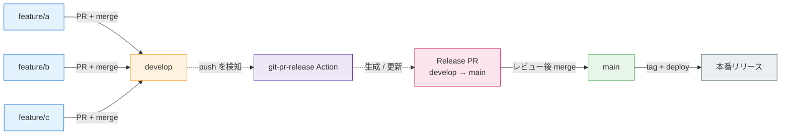

# Section 1: リリース PR 作成自動化

使うツール: [git-pr-release](https://github.com/x-motemen/git-pr-release) (GitHub Action から実行)

## Why — なぜやるか

業務アプリ運用でありがちな痛み:

- 「次のリリースに何が乗るか」を Slack やスプレッドシートで集計している
- リリース担当が `git log develop..main` を眺めて、PR を 1 つひとつ拾って本文に貼っている
- リリース後に「あの PR 入ってましたっけ?」が発生する

`develop → main` 運用なら **git-pr-release が「次のリリース PR」を常に最新に保ってくれる**。
人間は本文のチェックボックスを上から見ていけば、リリース内容のレビューが完結する。

## ブランチと PR の流れ



ポイント:

- **feature ブランチ → `develop`** は普段の PR 運用そのまま
- `develop` への push をトリガに git-pr-release が **`develop → main` のリリース PR** を作成 / 更新
- リリース PR の本文には `develop` に積まれた未リリース PR がチェックリストとして自動で並ぶ
- リリース PR をマージすれば本番反映 (デプロイは別途 Actions などで)

## ライブラリの選び方 — git-pr-release vs release-please

リリース PR 自動化の代表的な OSS は 2 つあります。**目的が違う** ので使い分けます。

| 観点                 | git-pr-release                    | release-please                               |
| -------------------- | --------------------------------- | -------------------------------------------- |
| ブランチ運用         | `develop` → `main` の二段         | `main` 一本 (trunk-based)                    |
| 必要な規約           | なし (PR タイトルがそのまま並ぶ)  | Conventional Commits 必須 (`feat:` `fix:` …) |
| リリース PR の中身   | 未リリース PR のチェックリスト    | 自動生成された CHANGELOG (semver bump 込み)  |
| バージョン番号       | 自前管理 (タグは手動 / 別 Action) | semver で自動算出                            |
| CHANGELOG.md         | 自前管理                          | 自動生成 / 自動更新                          |
| GitHub Release / tag | 自前 (任意)                       | マージで自動作成                             |
| 主な利用シーン       | 業務 Web アプリ、社内ツール       | OSS / ライブラリ、SDK                        |

判断の目安:

- **git-pr-release を選ぶケース** — `develop`/`main` の二段ブランチ運用、リリースは「乗せる PR を可視化したい」のが主目的、バージョニングは自分たちで管理している
- **release-please を選ぶケース** — `main` 一本運用、Conventional Commits を強制できる、CHANGELOG / semver / tag / GitHub Release までフル自動化したい

今回のハンズオンは **業務 Web アプリ向け** を想定するので git-pr-release を採用します。
OSS / SDK 寄りなら release-please の方が手数が少なく済みます。

## Demo — 完成形

- `develop` に feature PR がマージされると、git-pr-release が自動で
  - `develop → main` の **リリース PR を作成 / 更新**
  - 本文に「未リリース PR」をチェックボックス付きで列挙
  - 同じリリース PR を継続的に更新 (PR 番号は変わらない)
- リリース担当はリリース PR の本文を確認 → そのままマージするだけ

リリース PR のイメージ:

```markdown
- [ ] #123 @alice
- [ ] #128 @bob
- [ ] #131 @carol
```

## How — 手順

### 1. `.github/workflows/git-pr-release.yml` を追加

以下の内容をそのままコピーしてください (右上のコピーボタン)。

<<< ../../examples/github-actions/git-pr-release.yml [git-pr-release.yml]

### 2. `.github/git-pr-release-template.erb` (PR テンプレ) を追加

リリース PR の本文テンプレ。`pull_requests` をループしてチェックリストを生成する。`.github/release-drafter.yml` 等と並べて、リリース系の設定ファイルは `.github/` 配下に集約する。

<<< ../../examples/github-actions/git-pr-release-template.erb [.github/git-pr-release-template.erb]

### 3. main にコミット & push

作った 2 ファイルを `main` に乗せて、GitHub 側に届ける。以下をそのままコピペで OK。

```bash
git switch main
git add .github/workflows/git-pr-release.yml .github/git-pr-release-template.erb
git commit -m "ci: git-pr-release を導入"
git push origin main
```

### 4. develop ブランチを作成 & push

`main` から `develop` を切って push する。これで git-pr-release が動く土台が整う。

```bash
git switch -c develop
git push -u origin develop
```

ブランチ一覧の確認 URL: `https://github.com/<user-name>/dev-flow-handson-sandbox/branches`

### 5. リポジトリ設定

`Settings → Actions → General` を以下に設定する。

- URL 例: `https://github.com/<user-name>/dev-flow-handson-sandbox/settings/actions`
- **Actions permissions** セクション (ページ上部): "Allow all actions and reusable workflows" が選択されていることを確認 (デフォルト)
  - 理由: Marketplace の Action (`tagomoris/git-pr-release-action` など) を実行できる必要がある
- **Workflow permissions** セクション (ページ下部):
  - "Read and write permissions" を選択
    - 理由: git-pr-release が `GITHUB_TOKEN` を使ってリリース PR を作成 / 更新するため、書き込み権限が必須
  - "Allow GitHub Actions to create and approve pull requests" を ON
    - 理由: Actions から PR を立てる動作が本体機能なので、OFF だと PR が生成されない

### 6. 動かす

git-pr-release は **`develop` にマージされた PR** を集めてリリース PR を作る。なので「`develop` に直接 commit & push」ではなく、**feature ブランチ → PR → `develop` にマージ** の流れで動作確認する。

```bash
# develop からトピックブランチを切る
git switch develop
git pull
git switch -c feat/hello

# 変更を作って push
echo "console.log('hello')" > hello.js
git add hello.js
git commit -m "feat: hello スクリプトを追加"
git push -u origin feat/hello

# develop に対して PR を作成し、即マージ
gh pr create --base develop --head feat/hello --fill
gh pr merge --merge --delete-branch
```

`develop` への push トリガで Actions が走り、`git-pr-release` ジョブが `develop → main` のリリース PR を生成 / 更新する。リリース PR の本文に、いま `develop` にマージしたばかりの `feat/hello` PR がチェックリストに載っていれば成功。

::: tip 直接 push したらどうなる?

`develop` に commit を直接 push した場合、git-pr-release は対象 PR を見つけられず `No pull requests to be released` で exit 1 になる。チーム運用では `develop` を保護ブランチにして PR 経由マージを強制するのが一般的。

:::

## カスタマイズの勘所

- **PR タイトルに日付やバージョンを入れる**: ワークフローの env に `GIT_PR_RELEASE_TITLE_PREFIX` などを追加 (公式 README 参照)
- **対象 PR の絞り込み**: ラベルやユーザーで除外したいときは `.github/git-pr-release-template.erb` テンプレ内で `pull_requests` を Ruby のフィルタで絞る
- **タグ打ち / デプロイ連携**: リリース PR がマージされた後の `pull_request: closed` トリガで別 Action を組み、`git tag` や本番デプロイを実施
- **モノレポ**: パッケージ単位でリリースしたい場合は git-pr-release より release-please のほうが向く

## チェックポイント

- [ ] `develop` への push 後、Actions タブに `git-pr-release` の実行履歴がある
- [ ] `develop → main` のリリース PR がオープンしている (タイトルは "Release ..." 等)
- [ ] リリース PR 本文に未リリース PR がチェックリストとして並んでいる

→ 次は Section 2 (リリースノート) へ
